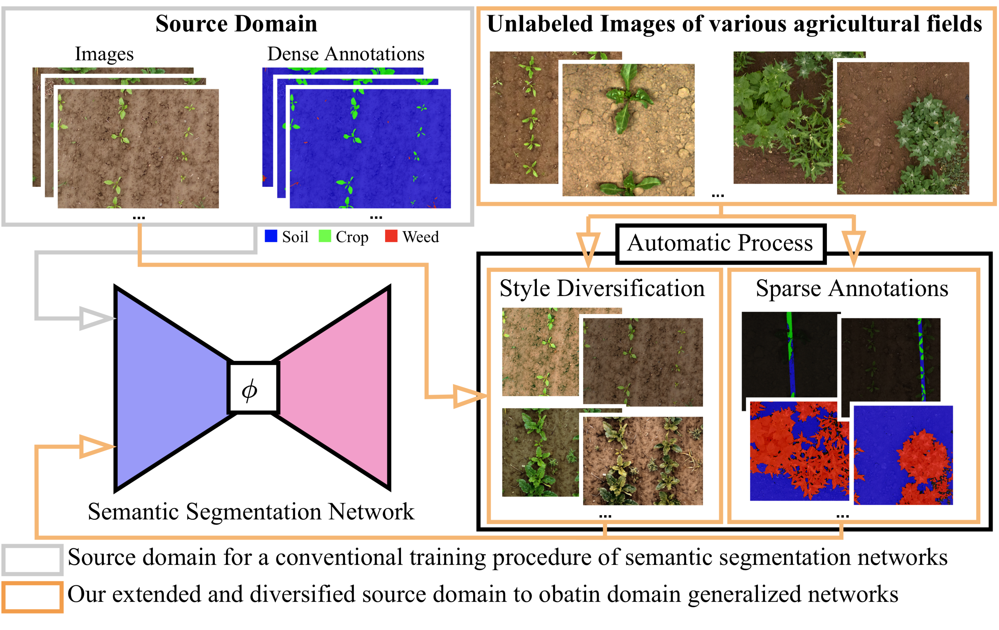

# DG-CWS
*[Towards Domain Generalization in Crop and Weed Segmentation for Precision Farming Robots](https://www.ipb.uni-bonn.de/wp-content/papercite-data/pdf/weyler2023ral.pdf)*

We present a novel approach to leverage unlabeled images captured from various
agricultural fields to develop domain generalized CNNs that enables agricultural
robots to perform a reliable semantic segmentation of the classes soil, crop,
and weed in different fields.



# Setup
```bash
conda create -n dgcws python=3.8
conda activate dgcws
pip install -r ./requirements.txt
pip install torch==1.10.1+cu113 torchvision==0.11.2+cu113 torchaudio==0.10.1+cu113 -f https://download.pytorch.org/whl/cu113/torch_stable.html
pip install setuptools==59.5.0
```

Please note that the cuda version depends on your local machine.

# Training

```python
python train.py --config ./configs/erfnet/config_uav_bonn.yaml --export_dir </path/to/export/directory>
```

Before you start the training you need to specify the paths to the datasets in the corresponding configuration file.

# Testing
```python
python test.py --config ./configs/erfnet/config_uav_bonn.yaml --export_dir </path/to/export/directory> --ckpt_path <path/to/erfnet.ckpt>
```

Before you start the testing you need to specify the paths to the datasets in the corresponding configuration file.

# Datasets
- [UAV Bonn](https://uni-bonn.sciebo.de/s/4Nty4gOzTZMy7jj)
- [UAV Zurich](https://uni-bonn.sciebo.de/s/C1oaCrzntP8ZwPz)
- [UGV Stuttgart]() -> tba
- [Sparse Crops](https://uni-bonn.sciebo.de/s/SvXTIrrlneHdwKN)
- [Sparse Weeds](https://uni-bonn.sciebo.de/s/AJpsgMeWP07W4yY)

# Pretrained Models
- [ERFNet](https://uni-bonn.sciebo.de/s/OjDkddy6esdA2UT)
- [DeepLabV3+](https://uni-bonn.sciebo.de/s/6IuB9pRt0eWYWlG)

# License
This software is released under a creative commons license which allows for personal and research use only. For a commercial license please contact the authors. You can view a license summary [here].
